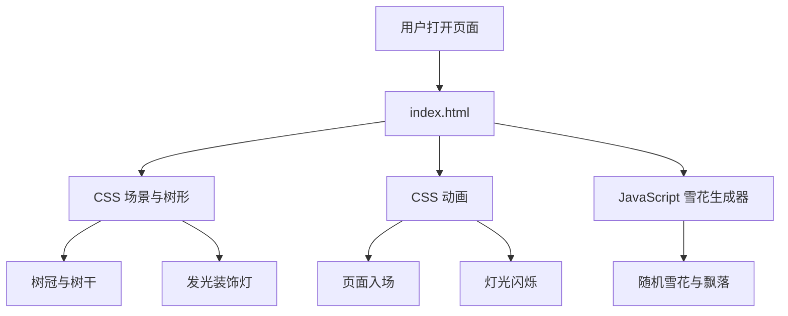

# 圣诞树网页架构概览

单文件 HTML 页面：CSS 绘制并动画化树形、灯光与入场效果，JavaScript 生成飘雪。无需框架或外部资源。

```mermaid
flowchart TD
    U[用户打开页面] --> H[index.html]
    H --> S[CSS 场景与树形]
    H --> A[CSS 动画]
    H --> J[JavaScript 雪花生成器]
    S --> T[树冠与树干]
    S --> L[发光装饰灯]
    A --> E[页面入场]
    A --> G[灯光闪烁]
    J --> F[随机雪花与飘落]
```
